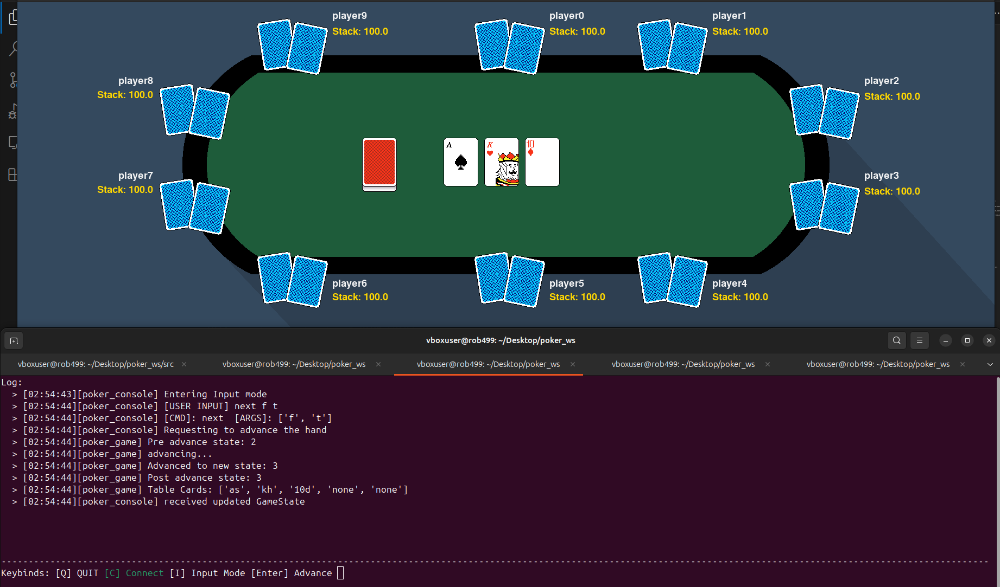
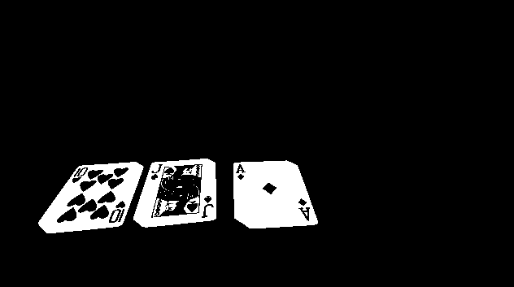

### Kyle Vickstrom Live Poker Hand Tracker ROB499

  
  
  

  

Using ROS2, this will visualize the current state of a poker table, allowing for easy game management and tracking.  

One window is a shell like game management node where the table and gameplay can be configured, edited, saved.  
A visualizer window displays the state of the table--visible cards, players in the hand, whose turn it is, pot size, etc.  
The last window is a collection of the other necessary nodes to run / automate.  

Current progress:
   One hand is playable via console UI manual control (cmd like inputs to override automation steps)  
   Working on configuring GoPro to recognize playing cards to update the visualizer with  

Next steps:  
* Finish Manual Control:  
   Need to add win logic.  
* Camera:  
   Filtering nodes to turn raw feed into several images, which can be used with edge detection etc to determine rank and suit  
* Arduino player action puck:  
   This is an arduino and a breadboard. It has a display, four buttons, and a potentiometer. Three buttons toggle which action the player wants (fold, call, bet), and the fourth is the confirmation button for the arduino to send the serial command to a control node. The potentiometer selects the size of the bet in 10 cent increments, mapped to the size of the current players stack. The lcd displays which action the player has selected /  the size of their selected bet before they press the confirmation button.  
  
## DEPENDENCIES  
* ROS2 Jazzy
* pygame  
* curses
* OpenCv
  
## NODES  
  
  - ### poker_console  
  `ros2 run poker poker_console`  
    
      This is a shell like interface that uses the same mechanisms as the camera, player puck,  
      etc to manually edit and run the game.  
      The console shows the game log, and interacts with the game via hotkeys and Input Mode.  

      Input Mode Commands:  
      - newgame: this starts an entireley new table with no players.  
      - add <player_name> <buy_in> <seat_pos> (optional)<afk>: this adds a new player to the table.  
      - action <action> <amount>: fold, call, bet  
      - next <end_by_fold> <force_advance>: advance the hand.  
                        waiting->preflop->flop->turn->river->finished and resets back to waiting.  
      - flop <card1> <card2> <card3>: this updates the flop param on the game node.  
      - turn <card>: this updates the turn card param on the game node.  
      - river <card>: this updates the river card param on the game node.
      - win <playername>: NOT IMPLEMETED. this assigns a hand winner upon fold and at the finished state.

   - ### poker_game  
   `ros2 run poker poker_game`  

      This is the game manager node. It is the only one to publish the game state.  
      It updates the game state based on action, adding / moving players, etc with action / service calls.  

   - ### poker_table  
   `ros2 run poker visualize_table`  

      This is the gui which shows the current state of the table.  
      Indicated who is in the current hand, the flop, turn, river, and betting info.  
      This node only subscribes to the game state and does not interact with the system besides visualizing.    
      Current state: Window created, assets 70% completed. Will be implemented when game is playable via console.  
   
   - ### poker_camera  
   `ros2 run poker poker_camera`  

      This is the node which just publishes a raw feed from the webcam.  
      Further nodes will filter and republish in order to detect what playing cards are present on the table.  

      CURRENTLY IN PROGRESS  

   - ### camera_viewer  
   `ros2 run poker camera_viewer`  

      This is a window that displays the camera feed. By changing a parameter,  
      the node will display the image at different parts of the filtering pipeline   
      to aid in debug and verify the camera is working and recognizing the correct cards.  

      CURRENTLY IN PROGRESS

