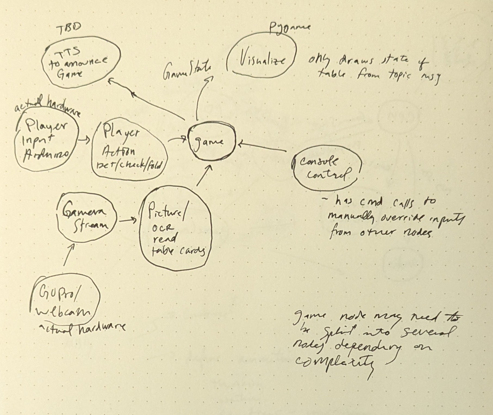

### Kyle Vickstrom Live Poker Hand Tracker ROB499

  

Using ROS2, this will visualize the current state of a poker table, allowing for easy game management and tracking.  

One window is a shell like game management node where the table and gameplay can be configured, edited, saved.  
A visualizer window displays the state of the table--visible cards, players in the hand, whose turn it is, pot size, etc.  
The last window is a collection of the other necessary nodes to run / automate.  

Current progress:
   Game will be played via console UI (cmd like inputs)

   Next step:
   Arduino player action puck (3 button inputs)
   Camera, picture, ocr nodes for table cards
  
## DEPENDENCIES  
* pygame  
  
## NODES  
  
  - ### poker_console  
  `ros2 run poker poker_console`  
    
      This is a shell like interface that uses the same mechanisms as the camera, player puck, etc to manually edit and run the game.  
      The console shows the game log, and interacts with the game via hotkeys and Input Mode.  

      Input Mode Commands:  
      - newgame: this starts an entireley new table with no players.  
      - add <player_name> <buy_in> <seat_pos> (optional)<afk>: this adds a new player to the table.  
      - turn <seat_pos> <action> <amount>: fold, call, bet
      - next <end_by_fold> <force_advance> <table cards>: advance the hand. Provide visible table cards, if any.  
                                                            waiting->preflop->flop->turn->river->finished  

   - ### poker_game  
   `ros2 run poker poker_game`  

      This is the game manager node. It is the only one to publish the game state.  
      It updates the game state based on action, adding / moving players, etc with action / service calls.  
        
      - #### Services  

   - ### poker_table  
   `ros2 run poker visualize_table`  

      This is the gui which shows the current state of the table. Indicated who is in the current hand, the flop, turn, river, and betting info. This node only subscribes to the game state and does not interact with the system besides visualizing.  
      Current state: Window created, assets 70% completed. Will be implemented when game is playable via console.  